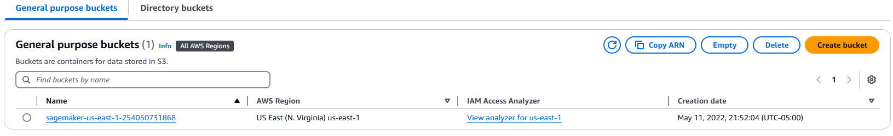
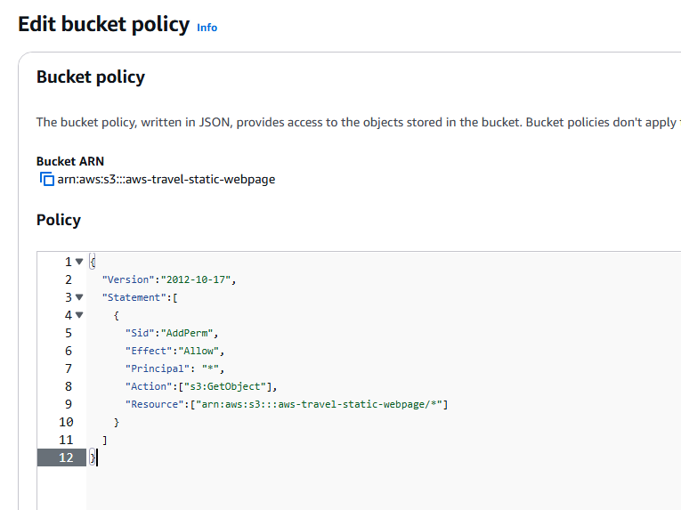
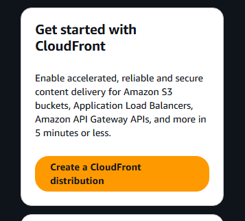

# Deploy Static Website on AWS

### Project Overview


The whole project has two major intentions to implement:

Hosting a static website on S3 and Accessing the cached website pages using CloudFront content delivery network (CDN) service. 

Recall that CloudFront offers low latency and high transfer speeds during website rendering.
Note that Static website hosting essentially requires a public bucket, whereas the CloudFront can work with public and private buckets.


| File/Folder   | Description                                                         |
|---------------|---------------------------------------------------------------------|
| **index.html** | The Index document for the website.                                |
| **/img**       | The background image file for the website.                        |
| **/vendor**    | Bootstrap CSS framework, Font, and JavaScript libraries needed for the website to function. |
| **/css**       | CSS files for the website.                                        |


### Addresses of the webpage are:
- https://dklx4rdur3abj.cloudfront.net/
- http://aws-travel-static-webpage.s3-website.us-east-1.amazonaws.com/
- https://aws-travel-static-webpage.s3.amazonaws.com/index.html

NOTE: By this time, these addresses will not work anymore, it was a test to demonstrate how to deply the wepage in a static bucket.

<p align="center">
  
</p>


<details open>
<summary> <b>Brief Review<b></summary>

### We followed this steps to reproduce a static website:
- Created a public S3 bucket and upload the website files to your bucket.
- Configured the bucket for website hosting and secure it using IAM policies.
- Used CloudFront to deliver content.
- Created a CloudFront Endpoint to access your the website.

</details>


### Development

<details close>
<summary> <b>1 - Create the S3 Bucket<b></summary>

- Navigate to the “AWS Management Console” page, type “S3” in the “Find Services” box and then select “S3”.
- The Amazon S3 dashboard displays. Click “Create bucket”.
<p align="center">

</p>

- In the General configuration, enter a “Bucket name” and a region of your choice. Note: Bucket names must be globally unique. Name it with dashes as an AWS Standard.
- In the Bucket settings for Block Public Access section, uncheck the “Block all public access”. It will enable the public access to the bucket objects via the S3 object URL.
<p align="center">

</p>

- Click “Next” and click “Create bucket”.
- Once the bucket is created, click on the name of the bucket to open the bucket to the contents.
<p align="center">

</p>
</details>


<details close>
<summary> <b>2 - Upload Files to the S3 Bucket<b></summary>

- Once the bucket has been created, click the “Upload” button.
<p align="center">

</p>

- Click the "Add files" and “Add folder” button, and upload the Student-ready starter code(opens in a new tab) folder content from your local computer to the S3 bucket.
- Click "Add files" to upload the index.html file, and click "Add folder" to upload the css, img, and vendor folders. NOTE: Do not select the udacity-starter-website folder. Instead, upload its content one-by-one.
<p align="center">

</p>

### Need help with uploading the files to S3?
- Sometimes the local machine's network setting or firewall might block, or the browser's Adblocker may prohibit the file upload, such as buysellads.svg file. In such a case, here are the workarounds:

#### Workaround 1
- Try using Chrome browser, and turn off the Adblocker, if not already. Here are the steps to turn off the Adblocker in Chrome:

- At the top right, click More (three dots) >> Settings.
- Click Security and Privacy >> Site Settings.
- Click Additional content settings >> Ads.
- Turn off Block ads on sites that show intrusive or misleading ads.

#### Workaround 2
- Use CLI commands to upload the files and folders:

- Verify the AWS CLI configuration. If not configured already, use:
```sh
aws configure list
aws configure 
aws configure set aws_session_token "<TOKEN>" --profile default 
```

- Upload files
#####  Create a PUBLIC bucket in the S3, and verify locally as 
```sh
aws s3api list-buckets 
```
#### Download and unzip the udacity-starter-website.zip 
```sh
cd udacity-starter-website 
```
#### Assuming the bucket name is my-bucket-202203081 and your PWD is the "udacity-starter-website" folder 
##### Put a single file. 
```sh
aws s3api put-object --bucket my-bucket-202203081 --key index.html --body index.html 
```
##### Copy over folders from local to S3 
```sh
aws s3 cp vendor/ s3://my-bucket-202203081/vendor/ --recursive 
aws s3 cp css/ s3://my-bucket-202203081/css/ --recursive 
aws s3 cp img/ s3://my-bucket-202203081/img/ --recursive 
```
</details>

<details close>
<summary> <b>3 - Secure Bucket Via IAM<b></summary>

- Click on the “Permissions” tab.
- The “Bucket Policy” section shows it is empty. Click on the Edit button.
<p align="center">

</p>

- Enter the following bucket policy replacing your-website with the name of your bucket and click “Save”.
<p align="center">

</p>

NOTES: 
- You will see warnings about making your bucket public, but this step is required for static website hosting.
- If we were not learning about static website hosting, we could have made the bucket private and wouldn't have to specify any bucket access policy explicitly. In such a case, once we set up the CloudFront distribution, it will automatically update the current bucket access policy to access the bucket content. The CloudFront service will make this happen by using the Origin Access Identity user.
</details>

<details close>
<summary> <b>4 - Configure S3 Bucket<b></summary>

- Go to the Properties tab and then scroll down to edit the Static website hosting section.
<p align="center">


</p>

- Click on the “Edit” button to see the Edit static website hosting screen. Now, enable the Static website hosting, and provide the default home page and error page for your website.

<p align="center">


- Did you notice that enabling the static website hosting requires you to make your bucket public?
In the snapshot above, it says "For your customers to access the content at the website endpoint, you must make all your content publicly readable."
- NOTE: For both “Index document” and “Error document”, enter “index.html” and click “Save”. After successfully saving the settings, check the Static website hosting section again under the Properties tab. You must now be able to view the website endpoint(opens in a new tab) as shown below:
</p>

<p align="center">

</p>

</details>

<details close>
<summary> <b>5 - Distribute Website Via CloudFront<b></summary>

- Select “Services” from the top left corner and enter “cloudfront” in the “Find a service by name or feature” text box and select “CloudFront”.
- From the CloudFront dashboard, click “Create Distribution”.
<p align="center">

</p>

- Use the following details to create a distribution:
<p align="center">


</p>

- Leave the defaults for the rest of the options, and click “Create Distribution”. It may take up to 10 minutes for the CloudFront Distribution to get created.

<p align="center">

</p>

- Note: It may take up to 10 minutes for the CloudFront Distribution to be created.
- Once the status of your distribution changes from “In Progress” to “Deployed”, copy the endpoint URL for your CloudFront distribution found in the “Domain Name” column.
Note - Remember, as soon as your CloudFront distribution is Deployed, it attaches to S3 and starts caching the S3 pages. CloudFront may take 10-30 minutes (or more) to cache the S3 page. Once the caching is complete, the CloudFront domain name URL will stop redirecting to the S3 object URL.

</details>


<details close>
<summary> <b>6 - Access in Web Browser<b></summary>

- Note - In the steps below, the exact domain name and the S3 URLs will be different in your case.

- Open a web browser like Google Chrome, and paste the copied CloudFront domain name (such as, [dgf7z6g067r6d.cloudfront.net](https://dklx4rdur3abj.cloudfront.net/)) without appending /index.html at the end. The CloudFront domain name should show you the content of the default home-page, as shown below:
- The page displayed at `https://dklx4rdur3abj.cloudfront.net/`

- Access the website via website-endpoint, such as http://<bucket-name>.s3-website.us-east-2.amazonaws.com/.
- Access the bucket object via its S3 object URL, such as, https://<bucket-name>.s3.amazonaws.com/index.html.
- All three links: CloudFront domain name, S3 object URL, and website-endpoint will show you the same `index.html` content.
- If we were not "hosting" the website on S3, we could have made the bucket private and host the content only through the CloudFront domain name. In such a case, we cannot access the private content using S3 object URL and website-endpoint.

#### Troubleshooting Tip
- After completing the project instructions, if you are unable to view the website contents, refer to the following guide: I’m using an S3 website endpoint as the origin of my CloudFront distribution. Why am I getting 403 Access Denied errors?(opens in a new tab)

- Refer to this official tutorial Using a website endpoint as the origin, with anonymous (public) access allowed(opens in a new tab), and verify if you have used the correct domain for your distribution. It should essentially be the Static website hosting endpoint of the form <bucket-name>.s3-website-region.amazonaws.com.

</details>

### Findings

<details open>
<summary> <b>Results <b></summary>

#### Static Webpages

<p align="center">


</p>


</details>


<details open>
<summary> <b>Issues<b></summary>

- No issues found yet

</details>

<details open>
<summary> <b>Future Work<b></summary>

- Improve a static website

</details>

<details open>
<summary> <b>Contributing<b></summary>

Your contributions are always welcome! Please feel free to fork and modify the content but remember to finally do a pull request.

</details>

<details open>
<summary> :iphone: <b>Having Problems?<b></summary>

<p align = "center">

[](https://www.linkedin.com/in/riawa)
[](https://t.me/issaiass)
[](https://www.instagram.com/daqsyspty/)
[](https://twitter.com/daqsyspty) 
[](https://www.facebook.com/daqsyspty)
[](https://www.linkedin.com/in/riawe)
[](https://www.linkedin.com/in/riawe)
[](https://wa.me/50766168542?text=Hello%20Rangel)
[](mailto:issaiass@hotmail.com)
[](mailto:riawalles@gmail.com)

</p

</details>

<details open>
<summary> <b>License<b></summary>
<p align = "center">

</p>
</details>